# Home Salon Redcliffe

## Purpose

The purpose of this assessment piece was to find a commercial client and develop an application utilising the appropriate technology stack. Subsequent to the completion of the task, the final product is intended to see purposeful use, and assist the business of the client in question.

Specifically, the chosen task was to perform a complete overhaul of an existing website for a client in the hair & beauty industry. The intent is to completely alter the UI/UX of the existing website in order to achieve a more modern aesthetic. On top of the improved experience for the clients customers, the website will also improve the experience for the business owner through the implementation of dynamic features.

Outside of the benefits for the client, the application will serve as a platform to further develop technical proficiency and showcase acquired skills to potential employers.

## Functionality/Features

The website which the business is currently using exists as a sequence of static web pages with minimal design features, and HTML text. In the creation of the new website, modern design principles will be applied with the use of a user friendly navigation bar, and made visually appealing through the use of CSS.

One of the major changes from the existing product would see the addition of an admin link which would redirect to a login page in which only the business owner would be granted access. Once logged in the owner would have the ability to perform the CRUD operations on the existing deals being sold, which in this case is a service. The application will possess the following Features.

- The client will have an admin account
- A client will have the ability to create a deal
- A client can edit existing deals
- A client can delete existing deals
- A customer view the available deals

## Target Audience

The target audience of the application is those who are seeking the services of the client the business is to be created for. It is also targeted at the client/business owner themselves to provide a more pleasing experience in the use of their website.
Potential employers in the tech space are also apart of the target audience as the website will act as a showcase of knowledge for the developers who created it.

## Tech Stack

MongoDB is a NoSQL database language used in the development of web applications. It will be used to store the information of the deals which are being sold, allowing the client to update, and alter them at will. The MongoAtlas cloud tool will be used as the management system responsible for handling the intricacies of the database. In order to create the server and API the express.js framework is to be used, it is one of the most popular web application frameworks built on JavaScript. Both of these technologies will use the node runtime environment which is designed to execute native JavaScript code outside of a web browser, and also permits the use of a large variety of existing functionality native the node extension. The React.js framework will be used for the front-end of the application in order to create the UI. Below is a list of the technology stack used in the development of the application.

- MongoDB
- Express.js
- React.js
- Node.js

## User Stories

[Link To Trello Board](https://trello.com/b/v73DMPfk/home-salon-redcliffe)

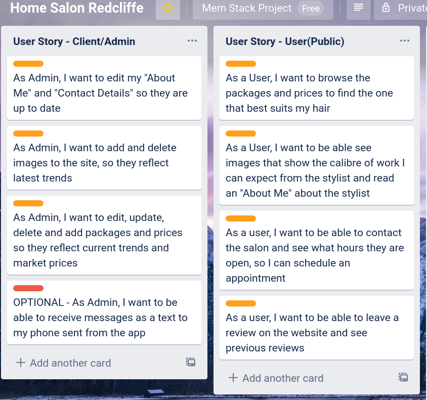

## Wire Frames

### Desktop

**Home**

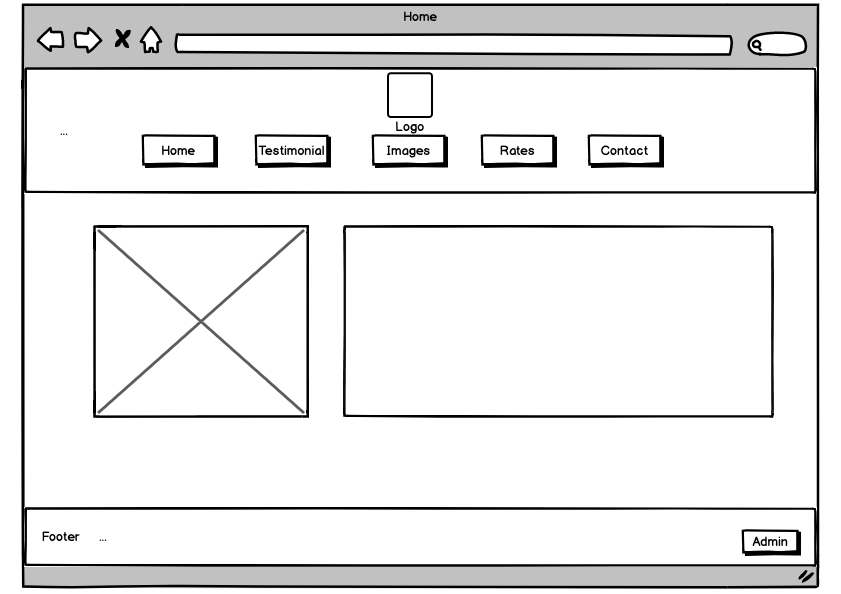

**Contact**

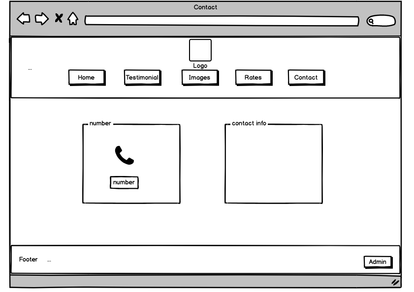

**Rates**

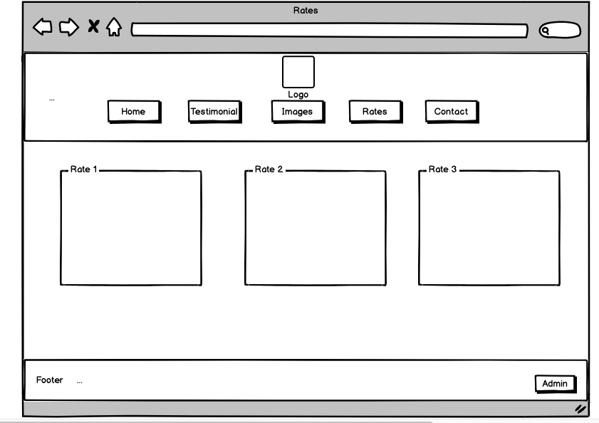

**Images**

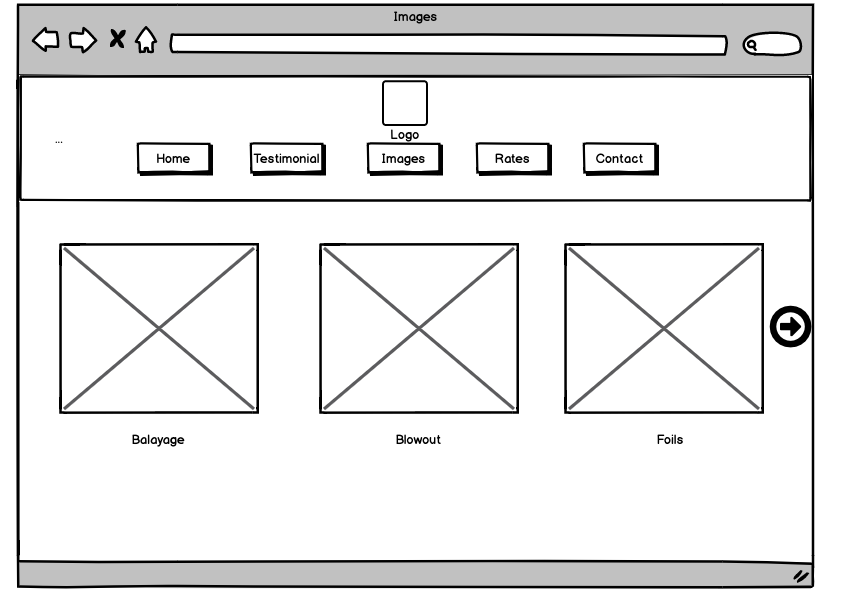

**Testimonials**

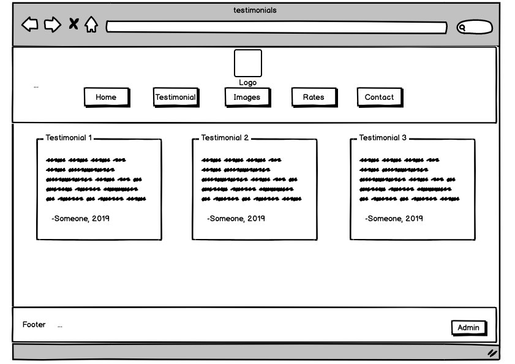

### Mobile

**Home**

**Contact**

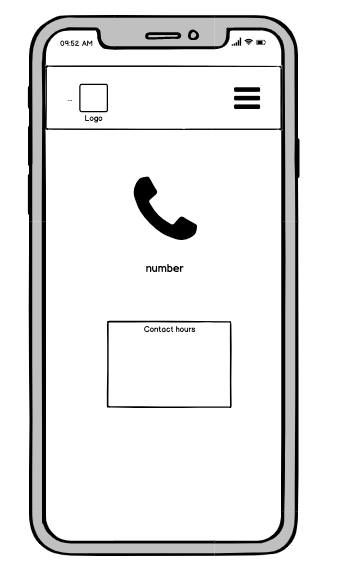

**Rates**

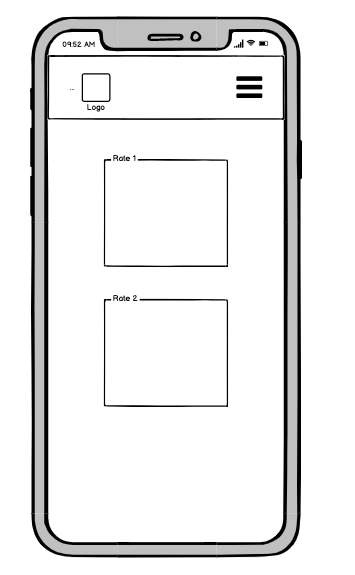

**Images**

**Testimonials**

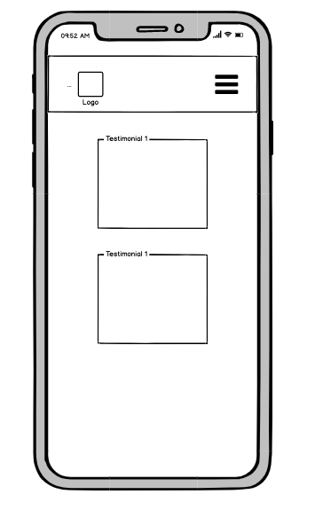

## Project Management

Below is a list of tools we used on this project:

- wireframes.cc
- trello.com
- stackedit.io
- cava.com
- pinterest.com.au
- google docs
- Slack
- GitHub
- AWS
- Heroku
- Cypress

We used wireframes.cc to create the wireframes, stackedit for the README.md file, canva and pinterest was for design ideas, we created a dev log and shared it on google docs, this was to keep a log of all team or client meetings and who was working on what. Slack was essential for communication. GitHub was used for source control and we deployed using AWS for front end and Heroku for the backend. Cypress was utilised for all testing.

### Design Samples

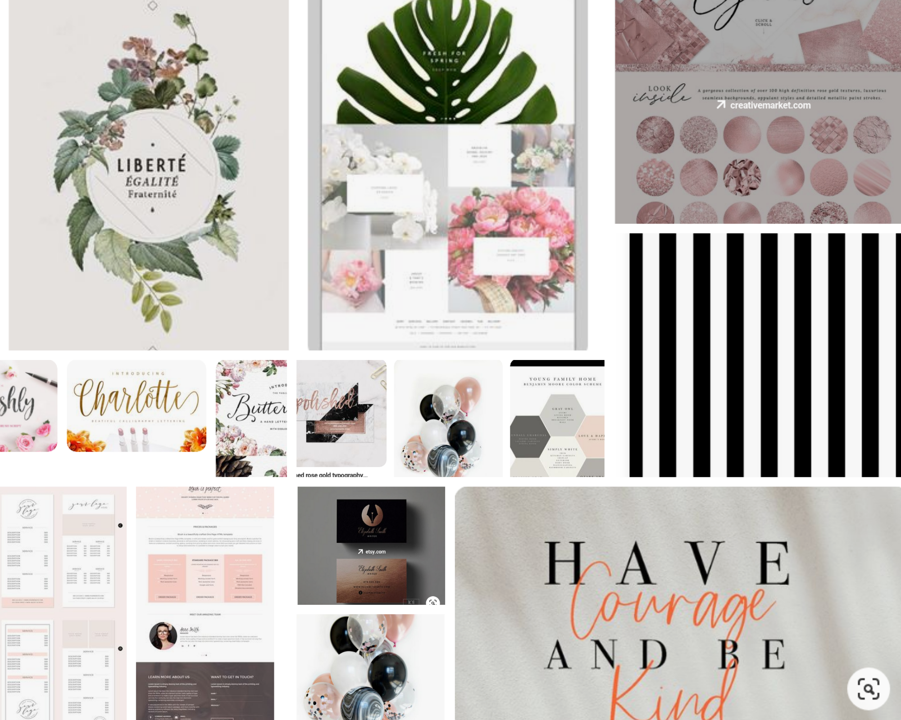
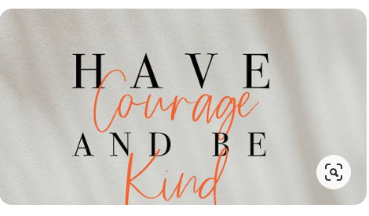
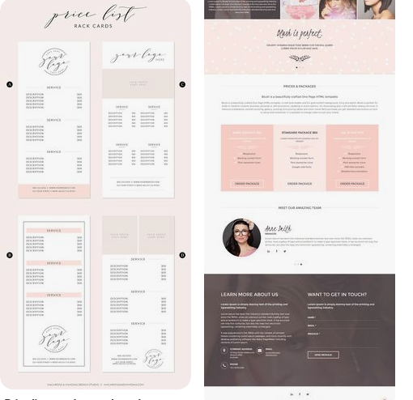
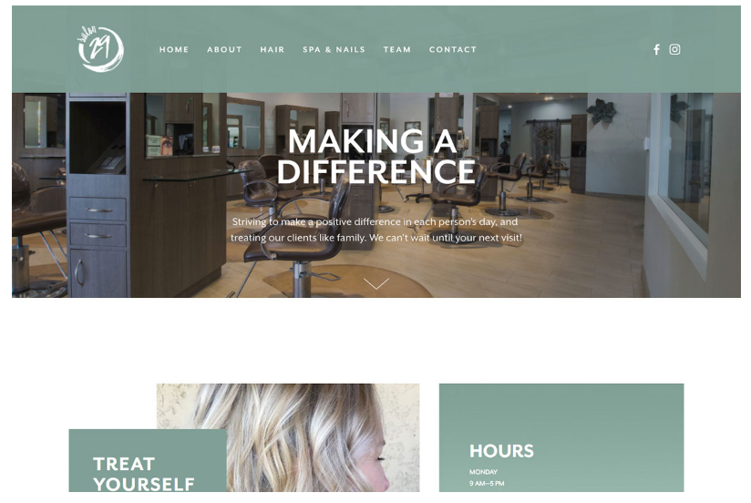
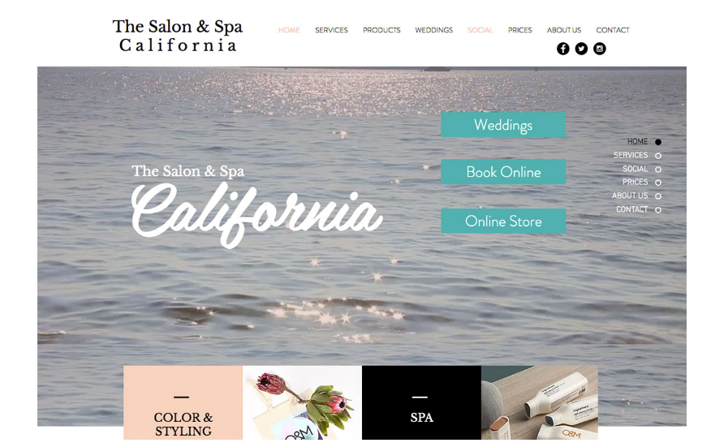

### Slack Sample

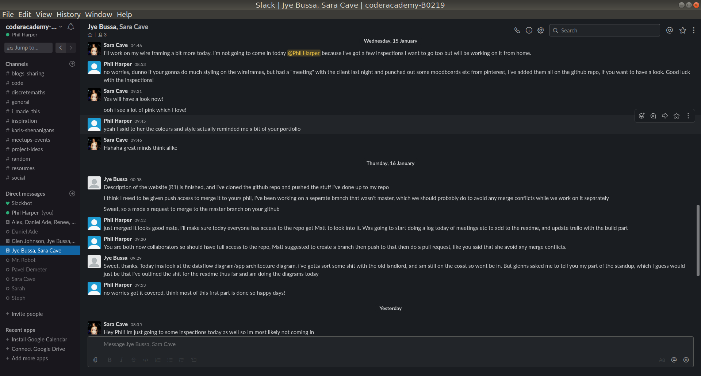

### Development Log

[Link to Dev Log](./docs/dev_log.docx)

## Dataflow Diagram

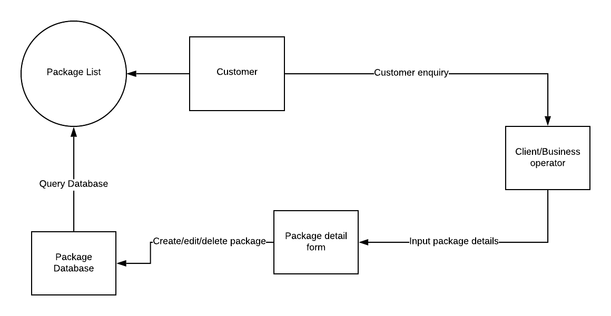

## App Architecture Diagram

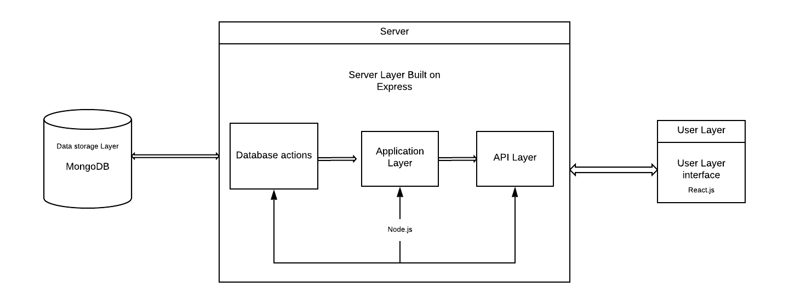

